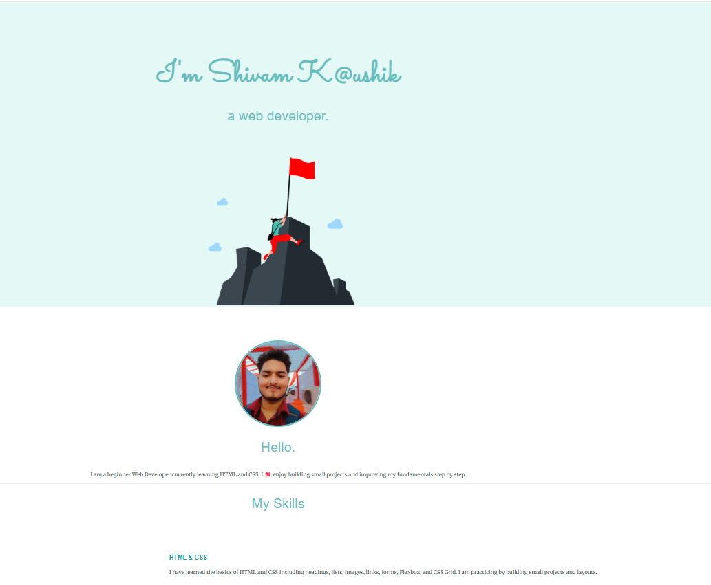
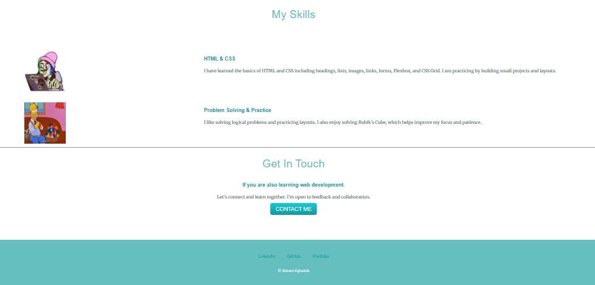

# 🌐 Personal Portfolio Website – HTML & CSS

This is my beginner-level personal portfolio website created using HTML and CSS while learning web development.

## 🔧 Technologies Used
- HTML5
- CSS3

## 📌 Features
- Personal introduction section
- Skills overview
- Contact section
- Clean and beginner-friendly layout

## 🌐 Live Demo
👉 https://kaushikshivam-stack.github.io/beginner-portfolio-html-css/

## 🙌 What I Learned
- HTML page structure
- CSS styling basics
- Working with images and fonts
- How to deploy a website using GitHub Pages

## 📸 Project Screenshots

### Home Page

### Footer Section

⭐ This project represents my progress and consistency in learning web development!
